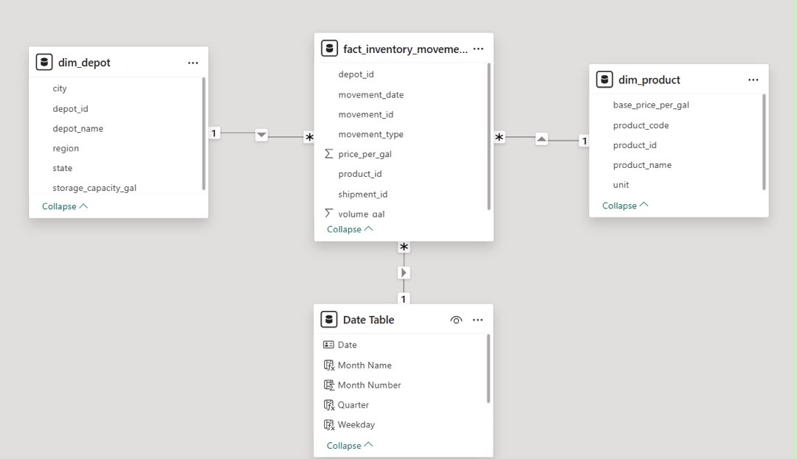
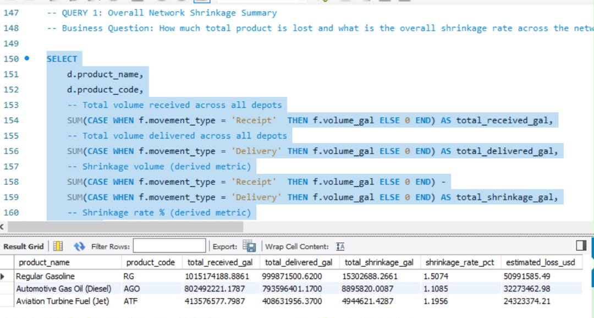
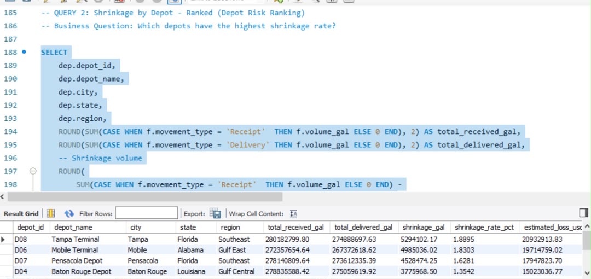
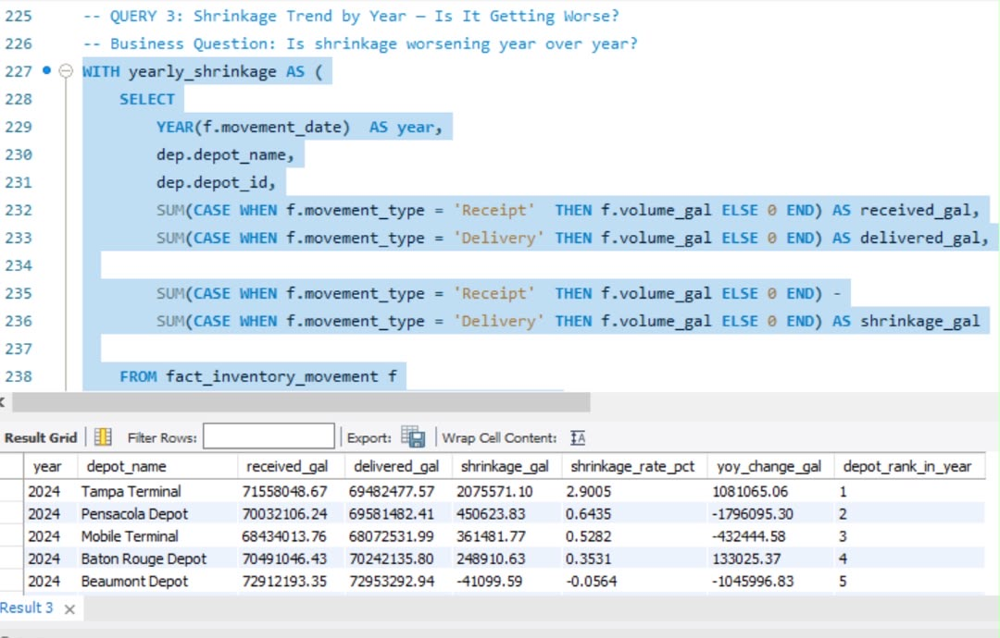
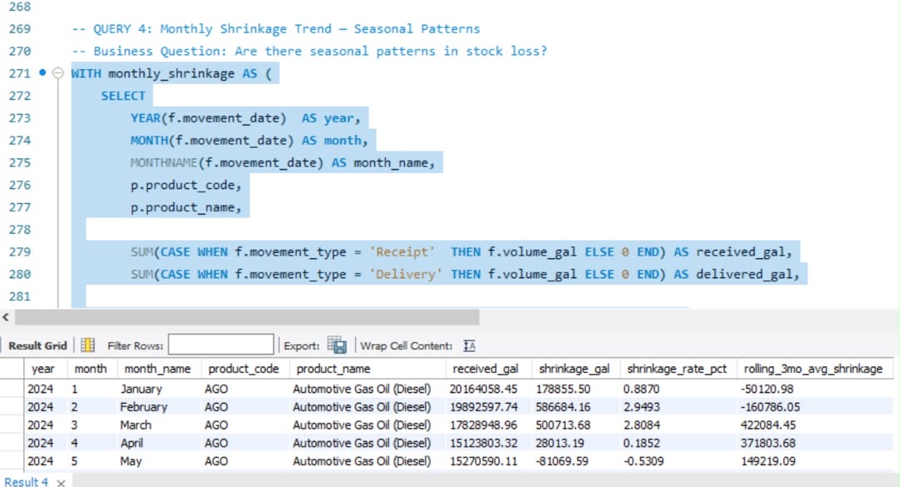
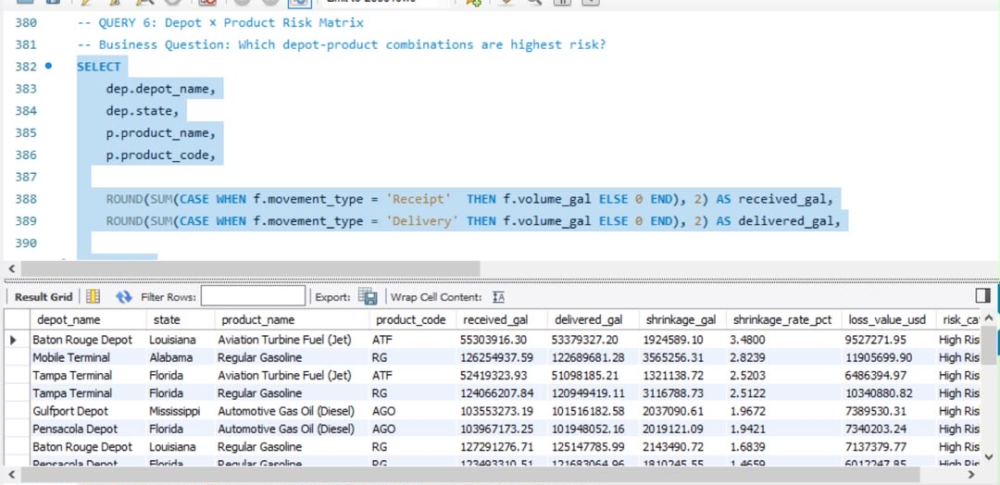
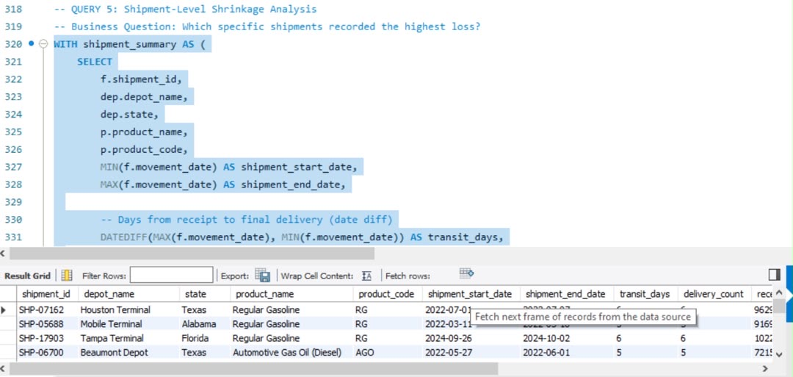
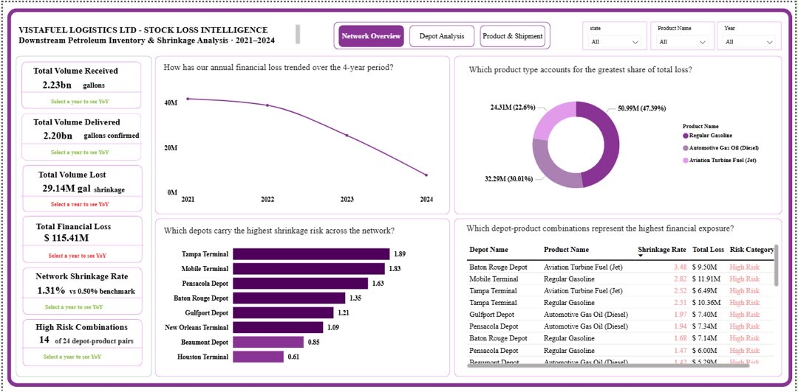
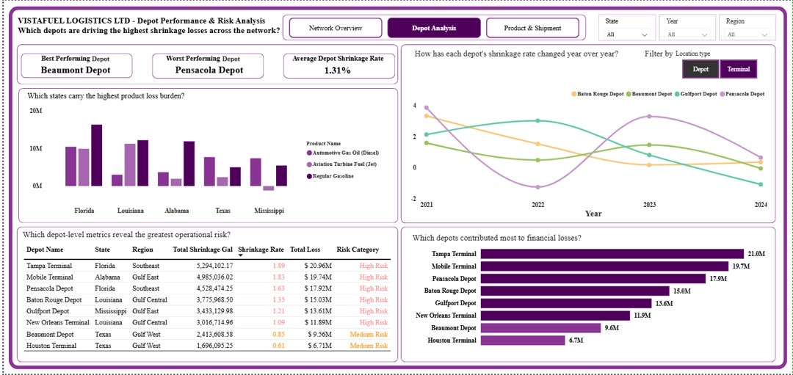
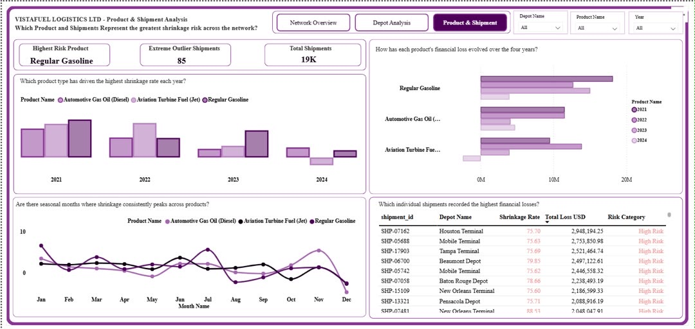

# VistaFuel Logistics Limited

## Downstream Petroleum Inventory & Stock Loss Analysis - A Terminal-to-Customer Shrinkage Investigation

*How much product is being lost between receipt at the terminal and delivery to the customer and which depots or product categories account for the highest shrinkage rates?*

---

## Executive Summary

VistaFuel Logistics Ltd operates a downstream petroleum distribution network spanning eight depots across five Gulf Coast states: Texas, Louisiana, Mississippi, Alabama, and Florida. This analysis examines four years of inventory movement data (2021–2024) across three refined product types: Regular Gasoline (RG), Automotive Gas Oil (AGO/Diesel), and Aviation Turbine Fuel (ATF) to quantify stock loss, identify its drivers, and recommend operational interventions.

---

## Key Findings

- **$115.41 million** in cumulative product value was lost across the network over four years averaging **$26.9 million per year.**
- All 8 depots exceed the industry benchmark shrinkage rate of 0.5%, indicating a network-wide systemic problem.
- Tampa Terminal is the highest risk depot overall, recording a 1.89% shrinkage rate and $20.9M in losses over the analysis period.
- Regular Gasoline accounts for 47% ($51M) of total financial losses, the single highest-risk product type.
- 85 individual shipments show shrinkage rates above 75%, flagged as critical anomalies requiring immediate investigation.
- Annual losses are improving: the shrinkage rate dropped from 2.23% in 2021 to 0.37% in 2024, an 83% reduction though the network has not yet reached the 0.5% benchmark.
- January, July, and November are the three peak shrinkage months across all products. January is driven by peak winter heating demand, July by summer driving season heat-driven gasoline evaporation, and November by pre-winter stockpiling activity. December consistently shows negative shrinkage, a timing artefact where month-end receipts generate deliveries recorded in January, not a genuine operational surplus.

---

## Top Recommendations

- Deploy real-time monitoring and infrastructure upgrades at Tampa Terminal and Mobile Terminal as priority locations.
- Commission an urgent investigation into the 85 extreme-outlier shipments with >75% shrinkage rates.
- Implement a dedicated gasoline evaporation control programme across all Gulf Coast depots, prioritising summer months.
- Establish shipment-level loss tracking as a standard operational KPI to move from network-level to shipment-level accountability.

---

## Project Overview

VistaFuel Logistics Ltd is a mid-sized downstream petroleum distribution company operating across the Gulf Coast region of the United States, with terminal and depot facilities in five states: Texas, Louisiana, Mississippi, Alabama, and Florida. The company receives bulk refined product from upstream refineries and pipeline operators, stores it at regional depots, and distributes it to retail fuel stations, commercial fleet operators, and aviation clients.

Over the four-year analysis period, VistaFuel processed over 123,000 inventory movement records across eight distribution depots. Despite strong delivery volumes, the operations team identified a persistent and growing gap between volumes received at terminals and volumes confirmed delivered to end customers. This gap referred to internally as stock loss or shrinkage represents direct financial exposure, potential regulatory risk under EPA volumetric accountability standards, and reputational risk with major commercial clients.

This analysis was commissioned by the VP of Operations and the Finance Director to provide a data-driven understanding of where, when, and how product loss is occurring across the distribution network and to quantify the financial impact of each source of shrinkage.

---

## Business Objectives

**The leadership team identified five core questions to guide this analysis:**

- How much total product volume is lost between receipt and delivery across the full network, and what is the overall shrinkage rate?
- Which depots consistently record the highest stock loss, and are losses worsening over time?
- Which product type: Regular Gasoline, Diesel, or Aviation Turbine Fuel experiences the greatest shrinkage by volume and by dollar value?
- Are there seasonal or monthly patterns in stock loss that suggest operational or environmental causes?
- What is the estimated annual financial cost of shrinkage, and which depot-product combinations represent the highest concentration of risk?

---

## Key Performance Indicators

| **KPI** | **Definition** | **Target** |
|---|---|---|
| **Network Shrinkage Rate %** | **(Total Volume Lost ÷ Total Volume Received) × 100** | **Below 0.5% industry benchmark** |
| **Total Volume Lost (gallons)** | **Receipt volume minus confirmed delivery volume** | **Trending downward year over year** |
| **Loss Value (USD)** | **Volume lost × average product price per gallon** | **Minimised per product and depot** |
| **Depot Risk Ranking** | **Depots ranked by shrinkage rate over the full period** | **All depots below 0.5% benchmark** |
| **Monthly Loss Trend** | **Rolling 3-month average shrinkage rate** | **Detect seasonal or worsening patterns** |
| **Shipment Risk Score** | **Shrinkage rate per individual shipment** | **Identify extreme outlier shipments** |

---

## About The Data

The dataset is a synthetic operational dataset generated using Python, modelled on the structure and patterns of real downstream petroleum inventory systems. The generation process was fully documented and is included as a project deliverable. All data is fully synthetic; no real company, individual, or transaction is represented.

---

## Table Structure

| **Table** | **Records** | **Key Columns** |
|---|---|---|
| dim_depot | 8 | depot_id, depot_name, city, state, region, storage_capacity_gal |
| dim_product | 3 | product_id, product_name, product_code, unit, base_price_per_gal |
| fact_inventory_movement | 123,984 | movement_id, shipment_id, movement_date, depot_id, product_id, movement_type, volume_gal, price_per_gal |

---

## Data Dictionary

| **Column** | **Table** | **Type** | **Description** | **Example** |
|---|---|---|---|---|
| movement_id | fact | VARCHAR(15) | Unique identifier per transaction row | MOV-001939 |
| shipment_id | fact | VARCHAR(15) | Groups one receipt with its deliveries | SHP-00294 |
| movement_date | fact | DATE | Date of the receipt or delivery event | 2021-01-27 |
| depot_id | fact | VARCHAR(10) | Foreign key linking to dim_depot | D01 |
| product_id | fact | VARCHAR(10) | Foreign key linking to dim_product | P01 |
| movement_type | fact | VARCHAR(20) | Receipt or Delivery | Receipt |
| volume_gal | fact | DECIMAL(15,4) | Volume in US gallons (NULL if missing) | 85000.0000 |
| price_per_gal | fact | DECIMAL(10,4) | Average price per gallon at movement date | 2.9021 |
| depot_name | dim_depot | VARCHAR(100) | Full name of the distribution depot | Houston Terminal |
| state | dim_depot | VARCHAR(100) | US state where depot is located | Texas |
| region | dim_depot | VARCHAR(100) | Gulf Coast region grouping | Gulf West |
| storage_capacity_gal | dim_depot | INT | Maximum storage capacity in gallons | 2500000 |
| product_name | dim_product | VARCHAR(100) | Full product name | Regular Gasoline |
| product_code | dim_product | VARCHAR(10) | Short product code | RG |
| base_price_per_gal | dim_product | DECIMAL(10,4) | Base price used for loss valuation | 2.8500 |

---

## Data Sources & Assumptions

- All data is fully synthetic. Generated using Python with documented random seed (42) for reproducibility.
- Product prices are based on US EIA historical fuel price patterns. Prices reflect real market movements: 2022 saw the highest prices (post-COVID demand recovery and Ukraine war supply disruption), moderating in 2023-2024.
- Shrinkage is defined as the positive difference between volume received and volume delivered within the same shipment_id.
- Negative shrinkage values (deliveries exceeding receipts at the shipment level) are treated as timing anomalies and documented in the limitations section.
- All volumes are measured in US gallons.

---

## Methodology

The analysis was conducted in four phases following the end-to-end analytics framework: Define → Acquire → Prepare → Explore → Analyse → Communicate → Recommend.

---

## Phase 1: Data Generation (Python)

A synthetic dataset was generated using Python (pandas, numpy) with a documented random seed for reproducibility. The generation script built in realistic operational patterns including seasonal demand variation, depot-level shrinkage differences, product price movements, and nine deliberate data quality issues to simulate real-world messiness.

---

## Phase 2: Data Cleaning (Python)

The raw dataset was cleaned using a dedicated Python cleaning script before loading into MySQL. The following issues were identified and resolved:

| **Issue** | **Rows Affected** | **Treatment** |
|---|---|---|
| **Duplicate rows (same movement_id)** | **1,002 rows** | **Removed; kept first occurrence per movement_id** |
| **Text embedded in volume_gal (e.g. '73935.99 gal')** | **1,243 rows** | **Stripped text suffix, converted to numeric** |
| **Negative volume values** | **625 rows** | **Set to NULL could not determine if entry error or system reversal** |
| **Outlier volumes (> 1,500,000 gallons)** | **380 rows** | **Set to NULL exceeds realistic operational ceiling** |
| **Inconsistent date formats (MM/DD/YYYY vs YYYY-MM-DD)** | **1,515 rows** | **Standardised to YYYY-MM-DD using pd.to_datetime()** |
| **Invalid depot_id (D99 not in dim_depot)** | **499 rows** | **Deleted; referential integrity violation** |
| **Missing movement_type** | **757 rows** | **Deleted; row has no analytical identity without this field. Movement type is the column that tells whether a row is a Receipt or a Delivery. The entire shrinkage calculation depends on this one column. If a row has no movement type it is like a bank transaction with no description you cannot tell if money went in or came out.** |
| **Missing volume_gal** | **2,474 rows** | **Retained as a NULL row still has identity for non-volume analysis. Inventing fuel volumes creates fictional shrinkage figures leadership could make multi-million dollar decisions based on made-up data** |
| **Missing price_per_gal** | **1,249 rows** | **Retained as NULL excluded from financial loss calculations only, because Filling missing prices with an average or median would distort financial loss calculations making some losses appear larger or smaller than they actually were based on fabricated price data. In petroleum analysis, price accuracy is critical because even a small difference in price per gallon multiplied across millions of gallons produces a massive difference in the loss value figure.** |

**Final clean row count: 123,984 rows across the fact table.**

---

## Phase 3: Data Engineering (MySQL)

The cleaned CSV files were loaded into MySQL using LOAD DATA INFILE. Primary keys, foreign keys, and indexes were defined to enforce referential integrity and support query performance. The data model was then reverse engineered in MySQL Workbench to produce the ERD.

---

## Phase 4: Analysis & Visualisation (MySQL + Power BI)

Seven SQL analysis queries were written covering all five business questions, using joins, aggregations, CTEs, window functions, date functions, and derived metrics. Results were imported into Power BI where a three-page interactive dashboard was built with DAX measures, KPI cards, slicers, and conditional formatting.

---

## Data Model

The data model follows a Star Schema pattern with fact_inventory_movement as the central fact table connected to two dimension tables. The model was defined in MySQL using foreign key constraints and reverse engineered to produce the ERD in MySQL Workbench.

A dynamic Date Table was also created in Power BI using: CALENDAR(MIN(fact_inventory_movement[movement_date]), MAX(fact_inventory_movement[movement_date])) to support time intelligence DAX measures. All relationships were set to Many-to-One with Single cross-filter direction.

---

## SQL Operations Performed

| **SQL Technique** | **Where Applied** |
|---|---|
| **INNER JOIN / LEFT JOIN** | **Joining fact table to dim_depot and dim_product in all analysis queries** |
| **Aggregation (SUM, AVG, COUNT)** | **Calculating total received, delivered, shrinkage, and loss values** |
| **GROUP BY** | **Summarising shrinkage by depot, product, year, month, and shipment** |
| **Window Functions (RANK, LAG, AVG OVER)** | **Depot risk ranking, YoY change, 3-month rolling average** |
| **CTEs (Common Table Expressions)** | **Multi-step shrinkage calculations in Queries 3, 4, and 7** |
| **Date Functions (YEAR, MONTH, DATEDIFF)** | **Monthly seasonal patterns, year-over-year trends, transit days** |
| **CASE statements** | **Risk category classification (High / Medium / Low)** |
| **NULLIF / DIVIDE** | **Safe division to avoid divide-by-zero in shrinkage rate calculations** |
| **Derived Metrics** | **Shrinkage rate %, loss value USD, cumulative loss, YoY change** |

---

## Analysis Result

### Q1: Network-Wide Shrinkage Summary

The network lost a total of 29.1 million gallons of product across the four-year period, representing a cumulative financial loss of $115.41 million. All three product types exceed the industry benchmark of 0.5%.

**Key insight:** Regular Gasoline accounts for 47% of total financial losses despite having the highest volume throughput. Its 1.51% shrinkage rate is the worst of the three products and is strongly linked to heat-related evaporation in Gulf Coast summer months.

### Q2: Depot Risk Ranking

All eight depots exceed the industry benchmark of 0.5%. Tampa Terminal and Mobile Terminal are the highest risk locations, together accounting for $40.6M (36%) of total network losses.

**Key insight:** Tampa Terminal worsened consistently year over year rising from 7th worst in 2021 to worst performing depot in 2024. This trend strongly suggests an infrastructure deterioration issue rather than a random or seasonal cause.

### Q3: Year-Over-Year Trend

Annual losses are improving significantly across the network, declining from $41.8M in 2021 to $7.9M in 2024 an 81% reduction in annual financial loss.

**Key insight:** The 2024 shrinkage rate of 0.37% is approaching the 0.5% industry benchmark for the first time. However the cumulative $114.1M loss over four years underscores the cost of the earlier years of high shrinkage and reinforces the urgency of sustaining improvement momentum.

### Q4: Seasonal Patterns

Clear seasonal patterns emerge in monthly shrinkage data. January and July consistently show the highest average shrinkage rates across all products.

| **Month** | **Avg Shrinkage Rate** | **Primary Driver** |
|---|---|---|
| January | 4.09% | Winter heating demand surge peak diesel throughput |
| July | 2.90% | Summer driving season peak gasoline throughput and heat-related evaporation |
| November | 2.69% | Pre-winter stockpiling elevated receipt and transfer volumes |
| March | 2.41% | Spring demand recovery |
| December | -3.30% | Timing anomaly: December receipts generate January deliveries |

**Note on negative December shrinkage:** The December negative figure reflects a timing mismatch where shipments received near month-end generate deliveries recorded in January. Shipment-level analysis provides a more accurate picture.

### Q5: Depot × Product Risk Matrix

14 of 24 depot-product combinations are classified as High Risk (shrinkage rate above 1%). The five highest-risk combinations account for a disproportionate share of total network losses.

**Key insight:** Baton Rouge Depot's ATF shrinkage rate of 3.48% is nearly 7 times the industry benchmark. This is the single highest-risk depot-product combination in the network and warrants immediate investigation into ATF handling protocols at this location.

### Q6: Shipment-Level Analysis

18,598 shipments were analysed for shrinkage. The median shipment shrinkage rate of 0.47% is just below the 0.5% benchmark, indicating most individual shipments perform acceptably. However 85 shipments show extreme shrinkage rates above 75%, representing a critical anomaly signal.

| **Finding** | **Value** |
|---|---|
| Total shipments analysed | 18,598 |
| Median shipment shrinkage rate | 0.47% |
| Average shipment shrinkage rate | 3.64% |
| Shipments with >75% shrinkage rate | 85 |
| Top shipment loss value (SHP-07162) | $2.95M |
| Most affected depot in top 20 | Mobile Terminal (Alabama) |
| Most affected product in top 20 | Regular Gasoline (RG) |

**Key insight:** The average shrinkage rate (3.64%) is pulled far above the median (0.47%) by the 85 extreme outlier shipments. This means the vast majority of shipments are performing near or below benchmark, but a small number of catastrophic shipments are disproportionately driving the network's financial loss figure.

---

## Dashboard & Visualizations

### Page 1: Network Overview

[Interact With Dashboard Here](VistaFuel_Analysis/VistaFuel_Analysis.pbix)

The overview page provides leadership with a one-glance summary of network-wide shrinkage performance.

**KPI Cards**

- Total Volume Received of 2.23 billion gallons.

- Total Volume Delivered of 2.20 billion gallons.

- Total Volume Lost of 29.14 million gallons.

- Total Financial Loss of $115.41M.

- Network Shrinkage Rate of 1.31% more than double the 0.5% industry benchmark.

- High Risk Combinations of 14 out of 24 depot-product pairs confirms that the shrinkage problem is not isolated to one or two locations; it is spread across more than half of all depot-product combinations in the network, indicating a systemic rather than localised issue.

**How Has Our Annual Financial Loss Trended Over the 4-Year Period?**

The line chart tells the most important story in this entire analysis: a clear and consistent decline in annual financial losses from approximately $40M in 2021 down to near $0M by the end of 2024. Each year shows a lower loss value than the previous year without exception, confirming that the improvement is not a one-off event but a sustained four-year trend.

The steepest decline occurs between 2023 and 2024 the line drops most sharply in the final year, suggesting that whatever operational changes were implemented in late 2023 and 2024 had the most significant impact on loss reduction.

The near-zero value at the end of 2024 is the headline finding of the entire dashboard: the network is approaching the point where annual losses are no longer a major financial burden but reaching and sustaining that position requires the operational interventions outlined in the recommendations.

**Which Product Type Accounts for the Greatest Share of Total Loss? (Donut Chart)**

Regular Gasoline dominates with $50.99M representing 47.39% of all network losses; nearly half of the total financial exposure from a single product type. This concentration in gasoline is not coincidental: gasoline is the most volatile of the three products, most susceptible to heat-driven evaporation in Gulf Coast summer conditions, and handled in the highest volumes across all eight depots.

Automotive Gas Oil (Diesel) contributes $32.29M (30.01%) a significant share despite diesel being less volatile than gasoline. The diesel loss figure points to measurement and handling inefficiencies rather than evaporation as the primary driver.

Aviation Turbine Fuel accounts for $24.31M (22.6%) the smallest share despite ATF being the highest-priced product per gallon. This suggests that the stricter aviation handling protocols applied to ATF are providing some level of protection compared to gasoline and diesel.

**Which Depots Carry the Highest Shrinkage Risk Across the Network? (Bar Chart)**

Tampa Terminal leads the network with a 1.89% shrinkage rate, the longest and darkest red bar on the chart representing a rate nearly four times the 0.5% industry benchmark. The visual immediately communicates that Tampa Terminal is an outlier requiring priority attention.

Houston Terminal at 0.61% stands as the network's best performer, the only depot showing amber rather than red colouring yet even Houston exceeds the benchmark, reinforcing that this is a network-wide systemic problem rather than a few isolated underperformers.

The colour gradient from dark red through amber tells a clear operational story: six depots are in the High Risk zone above 1%, two are in the Medium Risk zone between 0.5% and 1%, and zero are in the Low Risk zone below 0.5%.

**Which Depot-Product Combinations Represent the Highest Financial Exposure? (Risk Matrix Table)**

Baton Rouge Depot combined with Aviation Turbine Fuel records the highest shrinkage rate in the entire network at 3.48% nearly seven times the industry benchmark. This is particularly alarming given ATF's strict aviation handling requirements, suggesting either a specific infrastructure failure or a process breakdown unique to this depot-product combination.

Mobile Terminal combined with Regular Gasoline records the highest absolute financial loss of any single depot-product combination at $11.91M driven by the combination of high gasoline throughput, heat-driven evaporation, and Mobile Terminal's coastal Alabama location.

All eight rows visible in the table are classified as High Risk confirming that the most significant depot-product combinations across the network are all operating well above acceptable loss thresholds.

---

### Page 2: Depot Analysis

The depot analysis page supports operations managers in drilling into depot-level performance and trend behaviour.

**KPI Cards**

- Houston Terminal is confirmed as the best performing depot in the network with the lowest shrinkage rate of 0.61% yet even the network's top performer exceeds the 0.5% industry benchmark, reinforcing that shrinkage is a systemic network-wide challenge rather than an isolated depot problem.

- Tampa Terminal is the worst performing depot with a 1.89% shrinkage rate nearly four times the industry benchmark and $20.9M in total losses over the four-year period. Tampa Terminal's consistent worsening trend from 2021 to 2024 makes it the single highest priority location for operational intervention.

- The Average Network Shrinkage Rate of 1.31% sits 162% above the 0.5% industry benchmark. This gap represents the collective operational inefficiency of all eight depots and quantifies the financial upside available if the network reaches benchmark performance.

**How Has Each Depot's Shrinkage Rate Changed Year Over Year? (Line Chart)**

The multi-line trend chart is the most analytically rich visual on this page; it reveals that depot performance is not uniform or static but highly variable across both location and time.

Tampa Terminal is the standout negative trend; its line rises consistently from a moderate position in 2021 to the worst performer in the network by 2024. This is the only depot showing a sustained worsening trajectory while all others show improvement or stabilisation, strongly suggesting an infrastructure deterioration issue specific to Tampa Terminal rather than a network-wide cause.

Houston Terminal's line remains the lowest and most stable across all four years confirming it as a consistent benchmark performer and a potential model for operational best practice that could be studied and replicated at higher-risk depots.

Pensacola Depot shows extreme volatility recording the worst shrinkage rate in 2021, dropping significantly in 2022, spiking again in 2023, then moderating in 2024. This erratic pattern suggests inconsistent operational practices or seasonal equipment issues rather than a steady infrastructure problem.

The overall directional story is positive; most depot lines trend downward from 2021 to 2024, confirming that network-wide improvements are real and not limited to one or two locations.

**Which States Carry the Highest Product Loss Burden? (Clustered Column Chart)**

Florida carries the highest total financial loss burden of any state in the network driven by the combined losses of Tampa Terminal and Pensacola Depot, both located in Florida and both classified as High Risk. Florida's Gulf Coast climate, with extreme summer heat and humidity, creates elevated evaporation conditions particularly for gasoline storage.

Texas records the lowest total loss burden despite having two depots Houston Terminal and Beaumont Depot. Houston Terminal's strong performance drags the Texas average down, masking Beaumont Depot's Medium Risk classification.

Louisiana and Alabama record significant losses driven by Baton Rouge Depot and Mobile Terminal respectively, both High Risk locations with product-specific loss concentrations that warrant targeted intervention.

The depot performance table provides the most complete single view of network risk combining received volume, shrinkage rate, total loss, and risk category in one ranked display.

Tampa Terminal tops the table with 1.89% shrinkage and $20.96M in losses; the gradient formatting on the shrinkage rate column immediately draws the eye to this row as the deepest red in the table.

Houston Terminal sits at the bottom of the table with 0.61% and $6.71M the lightest colour in the shrinkage rate gradient and the only depot classified as Medium Risk rather than High Risk, providing a clear visual contrast between best and worst performers.

**Which Depots Contributed Most to Financial Losses? (Bar Chart)**

Tampa Terminal leads with $21.0M followed closely by Mobile Terminal at $19.7M and Pensacola Depot at $17.9M. These three Florida and Alabama depots together account for $58.6M more than 50% of the total $115.41M network loss from just three of eight locations.

Houston Terminal's bar at $6.7M is notably shorter than all others, less than a third of Tampa Terminal's bar providing a stark visual representation of what improved performance looks like in financial terms. If Tampa Terminal matched Houston Terminal's shrinkage rate, the network would recover approximately $14M in annual value.

---

### Page 3: Product & Shipment Deep Dive

The product and shipment page supports the finance and compliance team in understanding product-level and shipment-level risk.

**KPI Cards**

- Regular Gasoline is confirmed as the highest risk product appearing as the worst performer in shrinkage rate across most years and accounting for 47.39% of total network losses. Its combination of high throughput volume, high volatility, and Gulf Coast heat exposure makes it the primary target for shrinkage reduction efforts.

- 85 extreme outlier shipments with shrinkage rates above 75% represent the most urgent operational finding in the entire analysis. These are not normal operational losses at 75%+ shrinkage, more than three quarters of the product received on each of these shipments never reached the customer. The cause must be investigated physically before conclusions are drawn.

- Total Shipments of 19K reflects all unique shipment IDs in the fact table.

**Which Product Type Has Driven the Highest Shrinkage Rate Each Year? (Clustered Column Chart)**

Regular Gasoline consistently records the highest shrinkage rate across all four years: 2.5% in 2021, 2.3% in 2022, 1.8% in 2023, and 0.5% in 2024. The declining trend across all three products confirms that network improvements are benefiting every product type, not just gasoline.

Aviation Turbine Fuel shows an unexpected pattern recording higher shrinkage than Diesel in 2021 and 2022 despite ATF's stricter handling protocols. This anomaly is largely driven by the Baton Rouge Depot ATF combination which carries a 3.48% shrinkage rate and disproportionately influences the ATF network average.

The 2024 column is the most important visual on this chart; all three products show their lowest shrinkage rates of the four-year period, with Regular Gasoline finally approaching the 0.5% benchmark at 0.5%. This confirms that the improvement trend is real, sustained, and product-wide.

**Are There Seasonal Months Where Shrinkage Consistently Peaks Across Products? (Line Chart)**

January consistently shows the highest average shrinkage rate across all three products driven by peak winter heating demand which creates high diesel throughput volumes and elevated measurement pressure on depot infrastructure.

July shows the second seasonal peak aligned with the summer driving season which creates peak gasoline throughput and the highest heat-driven evaporation conditions of the year across Gulf Coast depots.

November (Pre-Winter Peak) a third peak emerges in November. This reflects pre-winter stockpiling activity where depots receive large volumes in preparation for the winter heating demand surge in December and January. Higher receipt volumes in a short period create elevated measurement pressure and increase the likelihood of handling losses.

December consistently shows negative shrinkage across all three products not a genuine operational surplus but a timing artefact. Shipments received near month-end generate deliveries recorded in January, creating an apparent excess in December and inflating January shrinkage figures. This must be interpreted at the shipment level rather than the monthly calendar level for accuracy.

**How Has Each Product's Financial Loss Evolved Over the Four Years? (Stacked Bar Chart)**

2021 dominates as the highest loss year for all three products the widest bars on the chart confirming that the worst of the network's shrinkage problem occurred at the start of the analysis period before operational improvements took effect.

Regular Gasoline's bar shrinks most dramatically from 2021 to 2024 reflecting both the improvement in gasoline shrinkage rate and the broader network improvements that disproportionately benefited the highest-volume product.

By 2024, the bars for all three products are noticeably thinner than 2021 and 2022 a clear visual confirmation that financial losses are trending in the right direction across the entire product portfolio.

**Which Individual Shipments Recorded the Highest Financial Losses? (Top 20 Shipments Table)**

SHP-07162 from Houston Terminal tops the table with a 75.70% shrinkage rate and $2.95M in losses, the highest individual shipment loss in the network. Notably this shipment originates from Houston Terminal which is the best performing depot overall confirming that even the network's top depot is not immune to extreme individual shipment events.

SHP-06700 from Beaumont Depot records the highest shrinkage rate in the table at 79.85% yet generates a lower loss value of $2.50M compared to SHP-07162's $2.95M. This directly illustrates the key analytical finding of this analysis a higher shrinkage rate does not automatically mean higher financial loss. Volume received and price per gallon determine the dollar impact and must be evaluated alongside the rate.

All 20 shipments in the table are classified as High Risk, confirming that the top 20 financial loss shipments are all operating at extreme shrinkage levels that go well beyond normal operational tolerance and require individual investigation.

---

## DAX Measures

All DAX measures are stored in a dedicated _Measures table in Power BI. Key measures include:

| **Measure** | **Category** | **Purpose** |
|---|---|---|
| Total Received Gal | Core Volume | Sum of all Receipt movement volumes |
| Total Delivered Gal | Core Volume | Sum of all Delivery movement volumes |
| Total Shrinkage Gal | Core Volume | Total Received Gal minus Total Delivered Gal |
| Shrinkage Rate Numeric | Core Volume | Shrinkage ÷ Received × 100 (numeric for calculations) |
| Shrinkage Rate % | Core Volume | Formatted text version for display in cards |
| Total Loss USD | Financial | Total Shrinkage Gal × Average Price Per Gallon |
| Risk Category | Classification | High Risk ≥1%, Medium Risk ≥0.5%, Low Risk <0.5% |
| Cumulative Loss USD | Time Intelligence | Running total of loss value from 2021 to present |
| Loss USD Prior Year | Time Intelligence | SAMEPERIODLASTYEAR calculation for YoY comparison |
| YoY Loss Change % | Time Intelligence | Percentage change in loss vs prior year |
| High Risk Combos | Classification | Count of depot-product pairs with rate ≥1% |
| Shipment Loss Value | Shipment Level | Loss value calculated at individual shipment context |

---

## Key Insights

### Insight 1: The Network Lost $115.41M Over Four Years, But Is Improving

**Finding:** Cumulative network losses totalled $115.41 million between 2021 and 2024. Annual losses declined from $41.8M in 2021 to $7.9M in 2024, an 81% reduction. The 2024 shrinkage rate of 0.37% is the first time the network has approached the 0.5% industry benchmark.

**Business Impact:** While the improvement trend is significant and demonstrates that operational changes are having an effect, the $115.41M cumulative loss represents a major financial exposure over the analysis period. At the 2021 rate, the network would have lost over $160M in the same four-year window.

**Recommendation:** Identify and document the specific operational changes that drove the 2022–2024 improvement and institutionalise them as standard operating procedures across all eight depots.

### Insight 2: All Eight Depots Exceed the Industry Benchmark

**Finding:** Not a single depot in the VistaFuel network meets the 0.5% industry benchmark for shrinkage rate. The best performer, Houston Terminal, still records 0.61% 22% above benchmark. The worst, Tampa Terminal, records 1.89% nearly four times the benchmark.

**Business Impact:** The fact that all eight depots are above benchmark indicates a systemic network-wide issue rather than isolated depot-level problems. This points to a common root cause, likely a combination of aging infrastructure, measurement methodology, and product handling standards that no amount of depot-specific intervention alone will fully resolve.

**Recommendation:** Commission a network-wide infrastructure audit focusing on meter calibration, storage tank integrity, and delivery measurement accuracy across all eight locations simultaneously.

### Insight 3: Tampa Terminal Is Worsening Year Over Year

**Finding:** Tampa Terminal's shrinkage rate rose from a relatively moderate position in 2021 to the worst-performing depot in the network by 2024, with a 1.89% rate and $20.9M in total losses. This is the only depot showing a consistent worsening trend while others improved.

**Business Impact:** A worsening trend rather than random variation strongly suggests infrastructure deterioration or a systematic process failure at Tampa Terminal. Left unaddressed, Tampa Terminal alone could account for a disproportionate share of future network losses.

**Recommendation:** Conduct an emergency operational review at Tampa Terminal, including physical inspection of storage tanks, delivery meters, and pipeline connections. Prioritise Tampa Terminal for infrastructure investment in the next capital expenditure cycle.

### Insight 4: Gasoline Accounts for 47% of All Financial Losses

**Finding:** Regular Gasoline generated $51.0M of the $114.1M total network loss 47% of all losses. Its 1.51% shrinkage rate is the highest of the three products, and seasonal analysis confirms January and July as peak loss months aligned with high gasoline throughput and summer heat-driven evaporation.

**Business Impact:** Gasoline evaporation is a well-documented phenomenon in the downstream petroleum industry. In Gulf Coast summer conditions, vapour losses from large storage tanks can be significant, particularly without vapour recovery equipment. Each percentage point of gasoline shrinkage reduced across the network translates to approximately $10M in recovered financial value.

**Recommendation:** Implement a gasoline vapour recovery programme at the five highest-risk depots. Prioritise operations in June through August when heat-driven evaporation is at its peak. Consider floating roof tank upgrades for high-volume gasoline storage.

### Insight 5: 85 Extreme Outlier Shipments Require Urgent Investigation

**Finding:** 85 individual shipments recorded shrinkage rates above 75%, meaning more than three-quarters of the product received never reached the customer. These 85 shipments are responsible for a significant share of the network's total financial losses and represent a pattern that cannot be explained by normal operational loss alone.

**Business Impact:** Extreme shrinkage events of this magnitude typically indicate one of three causes: catastrophic spillage or storage tank failure, measurement or data recording errors, or deliberate product diversion or theft. Each scenario has different operational, financial, and legal implications. The top shipment alone (SHP-07162) recorded a $2.95M loss.

**Recommendation:** Conduct an immediate investigation into all 85 flagged shipments. Cross-reference each shipment ID against physical delivery records, driver logs, and customer receipts to determine whether the loss is physical, measurement-based, or indicative of fraud or theft. Escalate confirmed cases to the relevant operational or legal team.

### Insight 6: Shrinkage Rate Percentage Alone Is Misleading

**Finding:** A direct comparison between two shipments illustrates this clearly. SHP-01016 recorded an 81.27% shrinkage rate but only $1.60M in financial loss. SHP-07162 recorded a lower 75.70% shrinkage rate but $2.95M in financial loss nearly doubled. The difference is driven by receipt volume and price per gallon, not the rate alone.

**Business Impact:** Prioritising operational intervention based on shrinkage rate percentage alone would direct resources to the wrong shipments. A depot with a moderate rate but very high throughput volume can generate far more financial loss than a depot with a high rate and low throughput.

**Recommendation:** Establish a dual-metric risk framework that ranks depots and shipments by both shrinkage rate percentage and absolute financial loss value simultaneously. Operational resources should be allocated based on the combined risk score, not either metric in isolation.

---

## Recommendations and Action Plans

| **Priority** | **Recommendation** | **Owner** | **Timeline** | **Expected Impact** |
|---|---|---|---|---|
| **1. Critical** | **Conduct emergency operational review at Tampa Terminal including tank inspection, meter calibration, and pipeline integrity check** | **VP Operations** | **Q3 2026** | **Reduce Tampa rate from 1.89% toward 0.5% benchmark** |
| **2. Critical** | **Investigate all 85 extreme outlier shipments (>75% shrinkage) cross-reference with physical delivery records and driver logs** | **Revenue Protection** | **Q3 2026** | **Recover potentially $10M+ in misattributed losses** |
| **3. Critical** | **Commission network-wide meter calibration audit across all 8 depots** | **Field Operations** | **Q3 2026** | **Reduce measurement error contribution to shrinkage** |
| **4. High** | **Implement gasoline vapour recovery programme at top 5 depots during June–August** | **Field Operations** | **Q4 2026** | **Reduce summer gasoline shrinkage by estimated 20–30%** |
| **5. High** | **Investigate Baton Rouge ATF shrinkage rate of 3.48% review ATF handling and storage protocols** | **Depot Manager** | **Q3 2026** | **Reduce highest depot-product risk combination** |
| **6. High** | **Establish dual-metric risk framework (rate % + loss value $) for depot and shipment prioritisation** | **Finance + Operations** | **Q4 2026** | **More accurate resource allocation** |
| **7. Medium** | **Implement shipment-level loss tracking as a standard operational KPI in the monthly operations review** | **IT + Operations** | **Q1 2027** | **Enable proactive identification of emerging outlier shipments** |
| **8. Medium** | **Document and institutionalise the operational changes that drove the 2022–2024 improvement** | **VP Operations** | **Q4 2026** | **Sustain and accelerate the improvement trend toward benchmark** |

---

## Limitations

- The dataset is fully synthetic. Results reflect designed patterns rather than genuinely discovered real-world findings. In a live deployment, all findings would require validation against actual meter data management system exports and delivery confirmation records.
- Negative volume values (625 rows) were set to NULL because the root cause could not be determined from the data alone. In a real deployment this decision would require confirmation from operations before implementation. Some of these may represent legitimate system reversal entries that should be excluded differently.
- The December negative shrinkage rates reflect a timing mismatch in the data model shipments received near month-end generate deliveries recorded in the following month. A more precise model would aggregate shrinkage at the shipment level exclusively rather than the monthly calendar period level.
- Shrinkage causes cannot be definitively attributed from volume data alone. The analysis identifies where and when losses occur but cannot distinguish between evaporation, meter error, spillage, theft, or recording inaccuracy without additional qualitative data from field operations.
- Product prices used for financial loss calculations are approximations based on EIA historical price patterns. Actual financial exposure figures may differ from those presented based on contracted pricing, hedging arrangements, or product grade differentials.
- The extreme outlier shipments (85 shipments with >75% shrinkage) may in part reflect data generation artefacts rather than genuine operational events. In a real dataset, these would require physical investigation to confirm before being used as the basis for financial claims.

---

## Conclusion

This analysis of VistaFuel Logistics Ltd's downstream petroleum inventory data across 2021 to 2024 delivers a clear, evidence-based answer to the central operational question: the network is losing product at every stage of the distribution chain, but the rate of loss is improving and the sources of loss are now quantifiable and addressable.

The most significant finding is the cumulative $115.41 million in product value lost over four years a figure that, while alarming, must be viewed alongside the equally significant finding that annual losses fell 81% between 2021 and 2024. The 2024 shrinkage rate of 0.37% represents the first time the network has approached the industry benchmark of 0.5%, demonstrating that the operational improvements already underway are working.

The operational fault data adds an urgent dimension. Tampa Terminal's consistent worsening trend, Baton Rouge Depot's 3.48% ATF shrinkage rate, and the 85 extreme outlier shipments each represent specific, addressable risk concentrations that go beyond network-wide averages. These are not diffuse systemic problems, they are identifiable locations, products, and events that can be targeted with precision.

The recommendation framework in this report prioritises immediate investigation of the extreme outlier shipments and Tampa Terminal, followed by a network-wide meter calibration audit and a structured gasoline vapour recovery programme. Together, these interventions if executed in 2026 have the potential to bring the network below the 0.5% benchmark for the first time and recover tens of millions in annual financial value.

With the analytical foundation, interactive dashboard, and documented recommendations in this report, VistaFuel's leadership team has the evidence and tools needed to move from identifying where the product is being lost to systematically stopping it.
